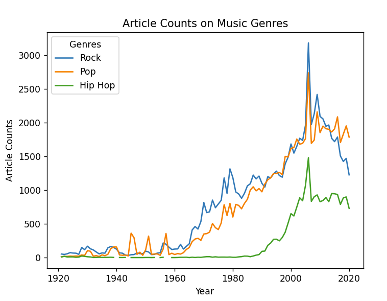
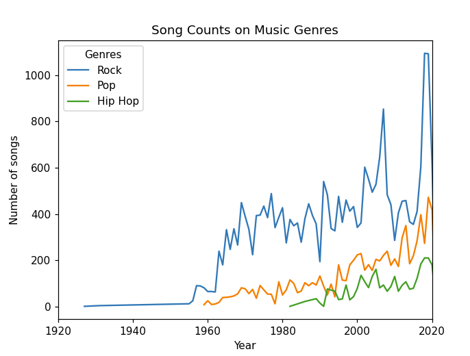
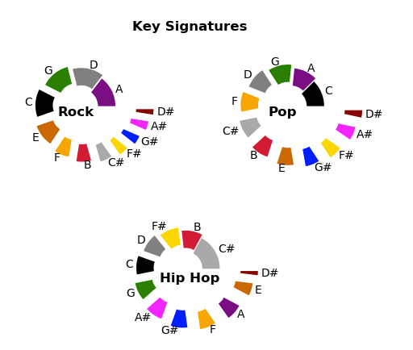
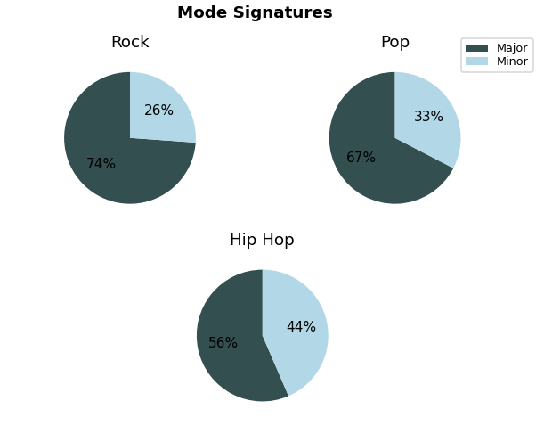
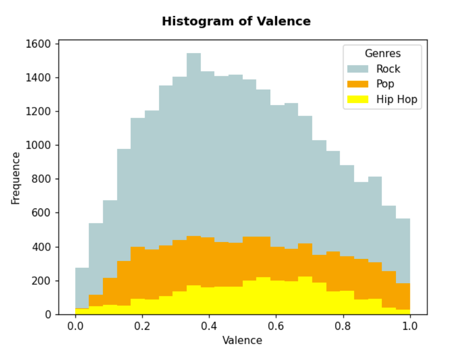
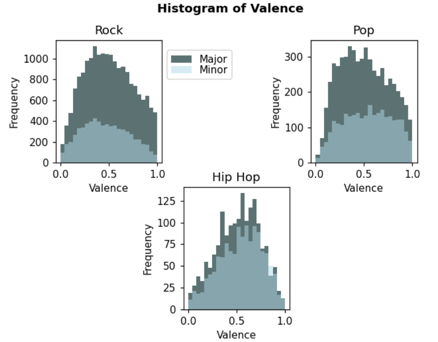

# Pitch_Pyfect Project

### Background:
Music is an essential part of our daily life.  Usually, song composition comes from a place of creativity.  In this project, we will approach it from an analytical viewpoint.  Lots of data can be collected about music theory and song structure—for example, key signature, beats per minute, beats per measure, tempo, etc.   

In this project, we mined through the SpotifyⓇ music database and identified the optimal ranges of these characteristics.

### Questions asked:
Looking at the genres of Rock, Pop, and Hip-Hop:

- What are the popular key signatures in each genre?
- Do certain genres prefer major or minor key signatures?
- Do major or minor keys affect valence?
- What is the average tempo in beats per minute?
- Are there differences in time signature?

### Datasets:
We utilized multiple datasets in this study. Two data sets containing 1.2 million and 175k tracks information were used. The last update on the 1.2 m csv was on 12/20/2020. The contributor first acquired the entire MusicBrainz catalog and then queried the album with UPC (Universal Product Code).  The contributor then combined this data with data from the Spotify API. The 175k csv dataset was last updated on 01/24/2021, and the contributor searched the SpotifyⓇ API for tracks based on the released year. The lyrics and genre information was gathered from two other csv data sets. This genre data is scraped from the Vagalume website by the contributor on Kaggle, and the other lyrics were gathered from a 250k+ lyrics dataset which is no longer available on Kaggle.

### Methods and Findings:
We first narrowed down our genres to Rock, Pop, and Hip-Hop music. With the artist lists we have under those three genres, we cross-checked the data with the Spotify data in hand to get a final data frame with tracks(songs), artists, genres, mode, key, tempo, valence, year, and lyrics. We then find out the popular keys, common mode, valence value tendencies, temp range for each genre. We plotted the number of songs we have in our study by publication year. With that information, we utilized New York Times API on the article count of keys words 'Rock Music,' 'Pop Music,' and 'Hip Hop' from 1921 to 2020. As for the lyrics, we first gather all the lyrics we have into one data frame, break down each sentence into words and count the occurrences. Due to the limitation of our knowledge, we have to remove certain none characteristic words by hand to come up with a top 10 list for each genre.

After analyzing the data, here are our findings:

- **Key Signatures**
	Songs are composed in key signatures. 
	Our data showed that pop and rock prefer G, C, D, A.  
	Pop and Rock don't utilize sharp keys as often.
	In Hip-Hop, sharp keys are more prevalent and key signatures are more evenly distrubuted.
	Hip Hop music is composed from a keyboard standpoint.  It is easier to utilize sharp keys using a keyboard or synthesizer.
	In Hip-Hop Music, there is more freedom to experiment using different key signatures.
    
    
- **Major vs. Minor**
	Key signatures can be major or minor.
	The majority of pop and rock music is composed in major keys. 
	Major keys are also more guitar-friendly. 
	Hip-Hop shows a 55%/ 45% split between major and minor keys .
	Because hip-hop music is composed of a keyboard standpoint, this genre is free to experiment more with major/minor keys.
    

- **Valence**
	Valence measures positive or happy tones vs negative or sad tones.
	A lot of times, major key signatures are used to compose happy songs and minor keys are used for sad songs.
	We predicted that songs composed in a major key would have a higher valence and songs composed in a minor key would have a lower valence.
	However, we found this not to be the case.
	It is possible to write a happy song in a minor key and a sad song in a major key.

	We also wanted to compare the overall valence across the 3 genres.  We were hoping to find that pop was skewed toward 1.  And rock was skewed toward 0.  
	However, rock and pop actually look very similar.  This just means that there is a normal distribution of both happy and sad songs in each genre.
	For Hip-Hop, songs are concentrated around the 0.5 range.
	This could mean that Hip-Hop songs have less range when it comes to happiness or sadness, and that Hip-Hop songs have a more consistent tone.

    
- **Tempo**
	Pop and Rock have a similar distribution.  Most songs are between 100 and 140 beats per minute.
	Most of the Hip-Hop songs we studied have a slower tempo.  According to the histogram, most songs lie between the range of 80 to 100 beats per minute.  
	
	Looking at the box plot, rock and pop have a median of around 125.
	Hip-Hop has a median of around 100 bpm.
	Our theory is that hip-hop songs have a slightly slower tempo on average because it is easier to rap over a slower tempo.
    
- **Beats Per Measure**
	There is no difference between beats per measure. All three genres compose using 4 beats per measure. (This chart didn’t tell us much)

**Conclusions**

After comparing the 3 genres in terms of song structure, we found rock and pop to be similar.  However, we did find a few differences when it came to hip-hop.
	
- If you want to compose a typical rock song, choose G, C, D, A and make your key signature major.  Set your valence anywhere between 0 and 1.  Rock songs can be happy, 		sad, or anywhere in between.  Also, make sure your song is around 125 bpm. 
	
- For pop, follow the same guidelines but know you have slightly more freedom to experiment with key signature because you are less reliant on the guitar
	
- For Hip-Hop, feel free to experiment with any key signature whether it be major or minor.  Set your Valence to around 0.5.  Hip-Hop songs aren’t overly happy or 		depressing.  They have a more consistent tone.  Finally, pull your tempo back to around 100 bpm, so it’s easier to rap over.

**Why are Pop and Rock similar?**

We searched for articles about each genre using the NYT API.  Pop and Rock were created around the same time. Pop and Rock have grown and evolved side-by-side. Hip-Hop emerged 30 years later with the birth of technology/digital recording.

### Limitations of the project:
SpotifyⓇ has over 50 million songs.  We are using a dataset of less than 5% of the SpotifyⓇ song library. We were also using the Brazilian website Vagalume for its genre, lyrics and artist data. Our data contains more rock songs than both pop and hip-hop.

### Applications:
- Guidelines for composing a commercially successful song in rock, pop, and hiphop genres.  

### References:  
- [Music theory wiki](https://en.wikipedia.org/wiki/Music_theory)  
- [Song lyrics from 6 genres](https://www.kaggle.com/neisse/scrapped-lyrics-from-6-genres)   
- [150K Lyrics Labeled with Spotify Valence](https://www.kaggle.com/edenbd/150k-lyrics-labeled-with-spotify-valence)   
- [Spotify 1.2M+ Songs](https://www.kaggle.com/rodolfofigueroa/spotify-12m-songs)   
- [Spotify Dataset 1921-2020, 160k+ Tracks](https://www.kaggle.com/yamaerenay/spotify-dataset-19212020-160k-tracks)   
- [NYT API](https://developer.nytimes.com/docs/articlesearch-product/1/overview)   

## Copyright 
**This work originated and belonged to Staci Wilson, Yang Shi, Zach Moormeier.**
